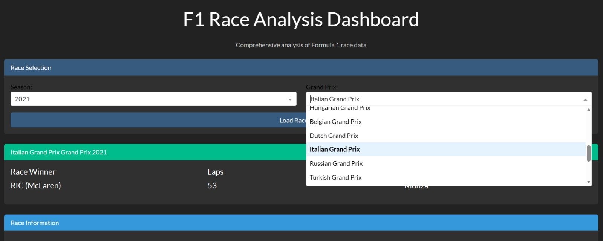
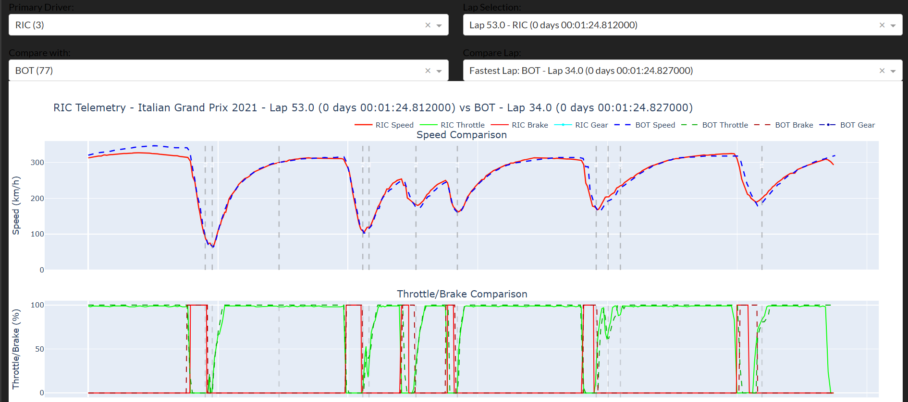
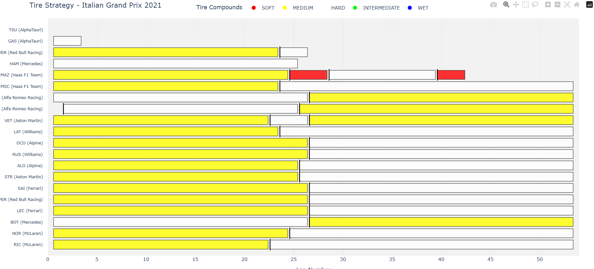
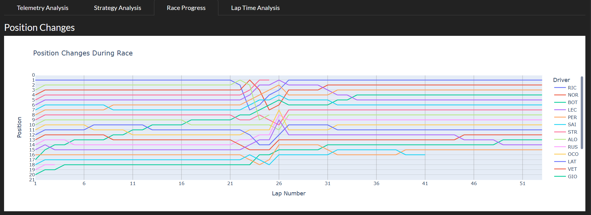
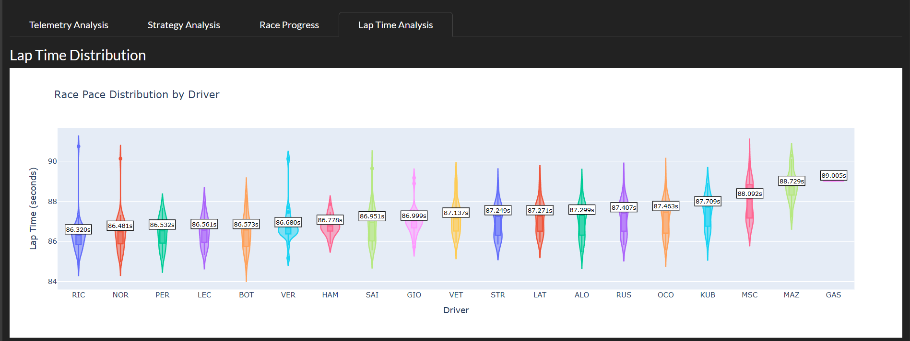

# F1 Race Analysis Dashboard

A comprehensive data visualization tool built to analyze Formula 1 race telemetry, strategies, and driver performance. This dashboard uses historical race data to provide insights into every Grand Prix.

## Features & Overview

### 1. Race Selection & Dashboard Home
The landing page allows for intuitive selection of historical race data. Users can select a specific **Season** and **Grand Prix** to load the relevant dataset. The header immediately displays key summary statistics, such as the Race Winner and total laps.



### 2. Driver Telemetry Comparison
Deep dive into driver performance with lap-by-lap telemetry comparison. This tool allows you to:
* Select a **Primary Driver** and a **Comparison Driver**.
* Visualize **Speed**, **Throttle**, **Brake**, and **Gear** usage overlaid on the same graph.
* Analyze specific laps to understand where time was gained or lost (cornering speeds, braking points, etc.).



### 3. Strategy Analysis: Tire Compounds
Analyze the strategic decisions made by each team. This Gantt-style chart visualizes:
* **Tire Compounds** used (Soft, Medium, Hard, Intermediate, Wet).
* **Stint Lengths** (how many laps each set of tires was used).
* Pit stop timing relative to other drivers.



### 4. Race Progress: Position Changes
Track the narrative of the race with a dynamic position change chart. This visualization maps every driver's position across all laps, highlighting overtakes, pit stop drops, and recovery drives.



### 5. Lap Time Distribution (Pace Analysis)
Understand driver consistency and raw pace using violin plots. Wider sections indicate a higher frequency of lap times in that range, allowing you to quickly spot:
* Average race pace.
* Consistency (narrower distribution).
* Outliers (slow laps due to errors or traffic).



---

## How to Run

1.  Clone the repository and install the dependencies.
2.  Launch the dashboard via the terminal:
    ```bash
    python main.py
    ```
3.  **Select Data:** Choose the Year and Grand Prix from the dropdown menus and click "Load Race."
    * *Note: Depending on your setup, data fetching via the API may take 5-10 seconds.*
4.  **Interact:** Navigate through the tabs to view different analyses (Telemetry, Strategy, Race Progress, etc.).

---

## Tech Stack
* **Python**
* **Dash (Plotly)** - For the web application framework.
* **Pandas** - For data manipulation.
* **FastF1** (Assumed) - For retrieving telemetry and timing data.

Thank you for using my dashboard!
